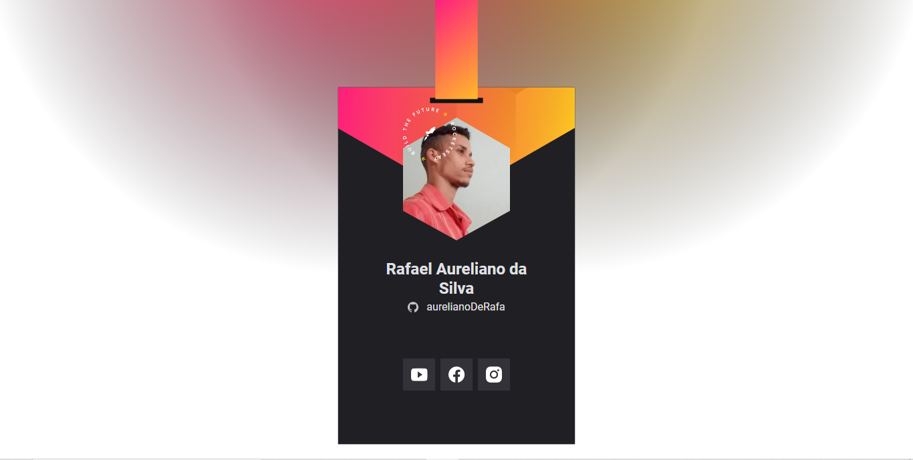

<h2 align="center"> 
  
</h2>

---
## Sobre
#### Projeto feito na **NLW Heat** da **rocketseat**  trilha **Origin.** Um Crachá Virtual com links para sua redes socia redes. Esse projeto usa a api no **GitHub** para pegar as informações do usuário

 ---
## 💻 Tecnologia utilizada
 * HTML 5 
 * CSS 3
 * JAVASCRIPT

